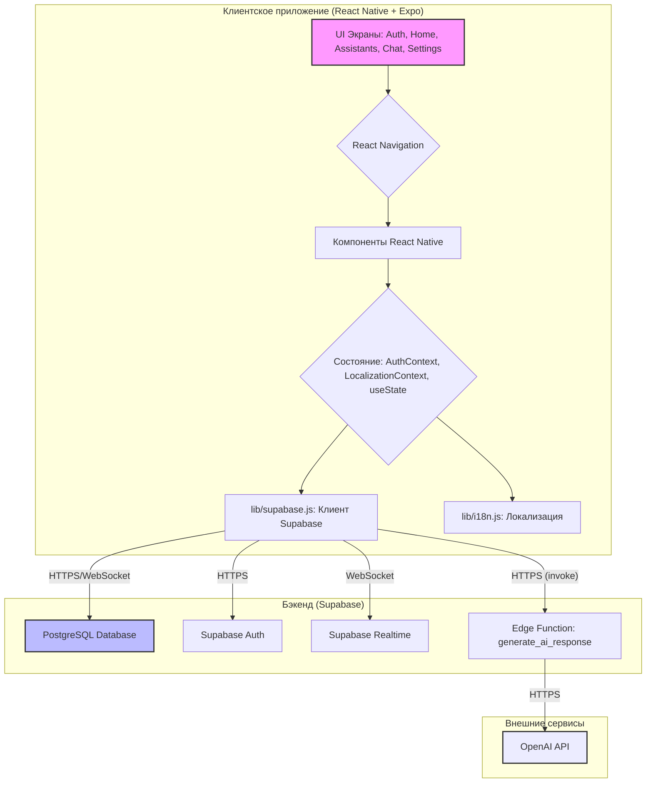

# Руководство по разработке AI Assistant

Это руководство предназначено для разработчиков, вносящих вклад в проект AI Assistant. Оно описывает архитектуру приложения, потоки данных, паттерны управления состоянием и лучшие практики.

## 1. Архитектура приложения

Приложение AI Assistant построено на кроссплатформенной архитектуре с использованием современных технологий для обеспечения гибкости, масштабируемости и удобства разработки.

### 1.1. Обзор компонентов

*   **Фронтенд (Клиентское приложение)**:
    *   **React Native + Expo**: Основной фреймворк для создания нативных мобильных приложений (iOS, Android) и веб-приложения из единой кодовой базы.
    *   **React Navigation**: Библиотека для реализации навигации между экранами.
    *   **JavaScript (ES6+)**: Основной язык программирования для фронтенда.
    *   **i18n-js & expo-localization**: Для поддержки многоязычности интерфейса.
    *   **UI Компоненты**: Стандартные компоненты React Native. В будущем возможно внедрение UI-библиотеки (например, Gluestack UI).

*   **Бэкенд (Серверная часть)**:
    *   **Supabase**: Backend-as-a-Service (BaaS) платформа, предоставляющая:
        *   **PostgreSQL**: Реляционная база данных для хранения всей информации (пользователи, чаты, сообщения, помощники, настройки).
        *   **Supabase Auth**: Для аутентификации и управления пользователями (email/пароль, magic links).
        *   **Supabase Realtime**: Для мгновенных обновлений в чате (новые сообщения появляются без перезагрузки).
        *   **Supabase Edge Functions**: Бессерверные функции (написаны на Deno/TypeScript) для выполнения логики на стороне сервера, в частности, для безопасного взаимодействия с OpenAI API.

*   **Искусственный интеллект (AI)**:
    *   **OpenAI API**: Используется для генерации ответов AI. Поддерживаются различные модели (GPT-3.5-turbo, GPT-4, GPT-4o и их вариации). Выбор модели доступен пользователю в настройках.

### 1.2. Диаграмма архитектуры

## 2. Поток данных

Понимание того, как данные перемещаются по системе, критически важно для разработки и отладки.

### 2.1. Аутентификация пользователя

1.  **Пользователь** вводит email/пароль на `AuthScreen`.
2.  `AuthScreen` вызывает соответствующую функцию из `lib/supabase.js` (например, `signInWithEmail`).
3.  `lib/supabase.js` обращается к **Supabase Auth**.
4.  **Supabase Auth** проверяет учетные данные и возвращает сессию или ошибку.
5.  `App.js` через `AuthContext` обновляет состояние аутентификации, что приводит к перенаправлению на главный экран.

### 2.2. Отправка сообщения в чат

1.  **Пользователь** вводит сообщение на `ChatScreen` и нажимает "Отправить".
2.  `ChatScreen` вызывает функцию `sendMessageToAI` из `lib/supabase.js`, передавая ID чата, текст сообщения, ID ассистента и настройки модели.
3.  `sendMessageToAI` вызывает **Supabase Edge Function** `generate_ai_response` через `supabase.functions.invoke()`.
4.  **Edge Function `generate_ai_response`**:
    a.  Валидирует JWT токен пользователя и входные данные.
    b.  Получает из базы данных **PostgreSQL** системный промпт для указанного `assistantId` и историю предыдущих сообщений для `chatId`.
    c.  Сохраняет сообщение пользователя в таблицу `messages` в **PostgreSQL**.
    d.  Формирует массив сообщений (системный промпт + история + новое сообщение пользователя).
    e.  Вызывает **OpenAI API** с сформированными сообщениями и настройками модели (температура, макс. токены, имя модели).
    f.  Получает ответ от **OpenAI API**.
    g.  Сохраняет ответ AI в таблицу `messages` в **PostgreSQL**.
    h.  Обновляет поле `updated_at` в таблице `chats`.
    i.  Если это первое сообщение в чате, генерирует заголовок чата с помощью **OpenAI API** (используя более простую модель) и обновляет запись в таблице `chats`.
    j.  Возвращает ID сохраненного сообщения AI и сам текст ответа AI клиенту.
5.  `ChatScreen` (в функции `sendMessage`):
    a.  Оптимистично добавляет сообщение пользователя и временный индикатор "AI печатает..." в локальное состояние `messages`.
    b.  После получения ответа от Edge Function, обновляет временное сообщение AI реальным ответом и ID.
6.  **Обновления в реальном времени**:
    a.  `ChatScreen` подписан на изменения в таблице `messages` для текущего `chatId` через **Supabase Realtime**.
    b.  Когда Edge Function сохраняет сообщение пользователя или AI в базу данных, **Supabase Realtime** отправляет это новое сообщение всем подписанным клиентам.
    c.  `ChatScreen` получает новое сообщение и добавляет его в список `messages`, обновляя UI. (Текущая реализация больше полагается на прямой ответ от Edge Function для немедленного обновления, но Realtime служит для синхронизации между устройствами или на случай, если прямой ответ не дошел).

### 2.3. Загрузка данных (список ассистентов, история чатов, настройки)

1.  Соответствующий экран (например, `AssistantsScreen`, `HomeScreen`, `SettingsScreen`) при монтировании вызывает функцию из `lib/supabase.js` (например, `getAssistants`, `getUserChats`, `getUserSettings`).
2.  Функция в `lib/supabase.js` выполняет прямой запрос к **PostgreSQL** через Supabase JS SDK.
3.  Данные возвращаются на экран и отображаются в UI.

## 3. Паттерны управления состоянием

Приложение использует комбинацию подходов для управления состоянием:

*   **Локальное состояние компонентов**: `React.useState` используется для управления UI-состоянием внутри отдельных компонентов (например, текст в поле ввода, состояние загрузки, видимость модальных окон).
*   **Контекст React (React Context API)**:
    *   **`AuthContext`** (`App.js`): Хранит информацию о текущем пользователе, сессии, статусе загрузки аутентификации и демо-режиме. Предоставляет функции `signOut` и `enterDemoMode`. Используется для глобального доступа к состоянию аутентификации и управления им.
    *   **`LocalizationContext`** (`App.js`): Хранит текущую выбранную локаль (`locale`), функцию для ее изменения (`setLocale`) и функцию перевода (`t`). Это позволяет компонентам получать доступ к переводам и изменять язык приложения.
*   **Асинхронные операции**:
    *   Все взаимодействия с Supabase (запросы к БД, вызов Edge Functions) являются асинхронными и обрабатываются с помощью `async/await`.
    *   Состояние загрузки (`loading`, `isSaving`, `isScreenLoading`) управляется в компонентах для отображения индикаторов активности.
*   **Realtime обновления**:
    *   `ChatScreen` использует `useEffect` для подписки на изменения в таблице `messages` через `supabase.channel(...).on(...).subscribe()`.
    *   При получении нового события (например, вставки нового сообщения) состояние `messages` обновляется, что приводит к перерисовке чата.

На данный момент не используются более сложные библиотеки управления состоянием, такие как Redux или Zustand, так как текущие потребности покрываются React Context и локальным состоянием. В будущем, по мере роста сложности, может быть рассмотрено их внедрение.

## 4. Лучшие практики для контрибьюторов

Для поддержания качества и консистентности кодовой базы, пожалуйста, следуйте этим рекомендациям:

*   **Структура проекта**:
    *   Придерживайтесь существующей структуры директорий (`screens`, `lib`, `supabase`, `assets`, `docs`).
    *   Новые утилиты или общие функции размещайте в `lib/`.
    *   Новые компоненты, специфичные для экрана, могут находиться внутри папки экрана или в общей папке компонентов, если они переиспользуемы.
*   **Именование**:
    *   Используйте `camelCase` для переменных и функций (например, `fetchUserData`).
    *   Используйте `PascalCase` для React-компонентов и типов/интерфейсов (например, `ChatScreen`, `interface ChatMessage`).
*   **Комментарии**:
    *   Добавляйте JSDoc-подобные комментарии к функциям, особенно к тем, что экспортируются из модулей.
    *   Комментируйте сложную или неочевидную логику.
*   **Обработка ошибок**:
    *   Используйте `try/catch` блоки для всех асинхронных операций, особенно при взаимодействии с API.
    *   Предоставляйте пользователю понятные сообщения об ошибках (можно использовать `alert()` или специальные UI-компоненты).
    *   Логируйте ошибки в консоль (`console.error`) для отладки.
*   **Переменные окружения**:
    *   Все API-ключи, URL Supabase и другие чувствительные данные должны храниться в файле `.env` (который находится в `.gitignore`).
    *   Используйте файл `.env.example` как шаблон для необходимых переменных.
    *   Доступ к переменным окружения в коде приложения осуществляется через `process.env` (для EAS Build) или `Constants.expoConfig.extra` (для локальной разработки с `app.config.js`).
*   **Работа с Supabase**:
    *   Все изменения схемы базы данных должны производиться через SQL-миграции, размещаемые в `supabase/migrations/`. Используйте `supabase db diff` и `supabase migration new` для их создания.
    *   Политики Row-Level Security (RLS) обязательны для всех таблиц, содержащих пользовательские данные, для обеспечения изоляции и безопасности.
    *   Edge Functions должны быть написаны на TypeScript, содержать валидацию входных данных и тщательную обработку ошибок.
*   **Локализация**:
    *   Все строки, отображаемые пользователю, должны быть добавлены в объект `translations` в `lib/i18n.js`.
    *   Используйте функцию `t()` из `LocalizationContext` для получения переведенных строк в компонентах.
*   **Тестирование**:
    *   (В будущем) Пишите юнит-тесты для утилит, функций бизнес-логики и компонентов.
    *   (В будущем) Рассмотрите возможность добавления интеграционных тестов для проверки взаимодействия с Supabase и E2E тестов для ключевых пользовательских сценариев.
*   **Git Workflow**:
    *   Работайте в отдельных ветках для каждой новой фичи или исправления бага (`feature/название-фичи`, `fix/описание-бага`).
    *   Пишите осмысленные сообщения коммитов, следуя общепринятым стандартам (например, Conventional Commits).
    *   Создавайте Pull Request'ы для ревью кода перед мержем в основную ветку.
*   **Документация**:
    *   При добавлении новой функциональности или внесении значительных изменений в архитектуру, обновляйте соответствующую документацию в папке `docs/`.
*   **UI и UX**:
    *   Придерживайтесь принципов чистого и интуитивно понятного дизайна.
    *   Если будет внедрена UI-библиотека (например, Gluestack UI), следуйте ее гайдлайнам.
    *   Обеспечивайте хорошую производительность, особенно для списков и анимаций.
*   **Безопасность**:
    *   Никогда не храните чувствительные ключи или данные на стороне клиента.
    *   Все вызовы к OpenAI API должны производиться исключительно через Supabase Edge Functions.
    *   Тщательно проверяйте RLS-политики.

Следование этим практикам поможет поддерживать проект в хорошем состоянии и облегчит совместную работу.
